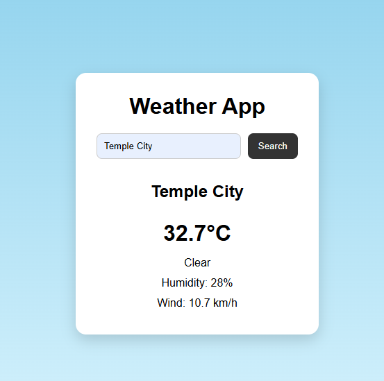

# JavaScript Weather App

A simple weather application that retrieves weather information using the Open-Meteo API.

## Features

- Search for weather information
- Fetch weather data from an API
- Display temperature and weather conditions
- Handle API responses
- Display errors when weather data cannot be retrieved

## Technologies Used

- HTML
- CSS
- JavaScript
- Open-Meteo API
- Fetch API
- JSON
- Async/Await

## What I Learned

While building this project, I practiced:

- Working with APIs
- Using fetch() to retrieve data
- Working with JSON responses
- Using async/await
- Handling errors
- Updating the DOM with API data
- Working with user input

## How to Use

1. Enter a location in the search field.
2. Submit the search.
3. The application retrieves the weather information from the Open-Meteo API.
4. View the returned weather information.

## Screenshot

## Live Demo

[View the Live Weather App](https://sivanathilak.github.io/weather-app/)
